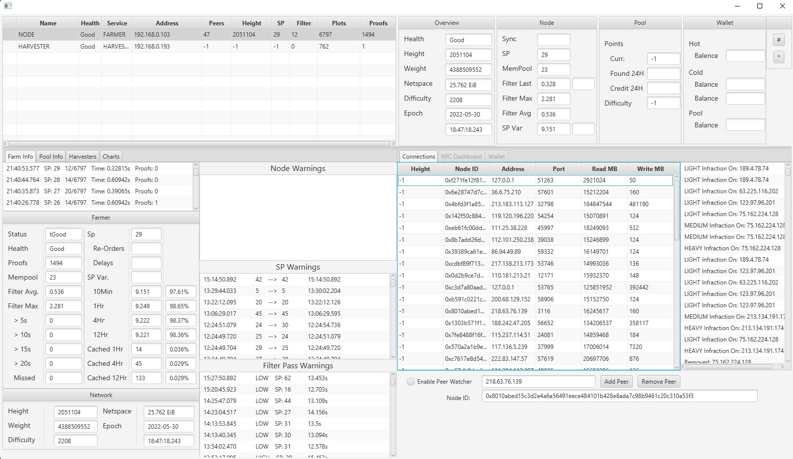

# Chia-Node-Monitor
JavaFX GUI RPC client and log parser to monitor node and network health.

Keeps tract of time between signage points and amount being cached. Uses various RPC calls as to track current net space and to retrieve all connected nodes at a set interval and their block height. Implements and infraction system that gives points to nodes that fall behind and disconnects them if they are constantly behind and never catch up as to avoid added overhead and poisoning of one’s node from their late network relays.

Signage Point times are retrieved by tailing the log file and adding them to internal data structures to extract various metrics and monitor the health of ones node , filter passes and proofs found.

